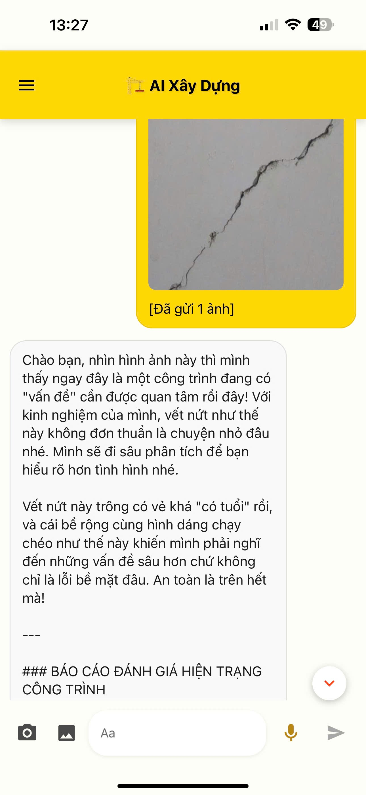
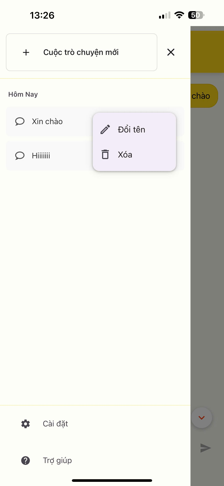

# 🏗️ BDAM - AI Tư Vấn & Nhận Định Hư Hại Công Trình

## 📖 Giới thiệu

**BDAM** là ứng dụng di động thông minh sử dụng trí tuệ nhân tạo để tư vấn xây dựng và đánh giá hiện trạng công trình. Ứng dụng được phát triển bằng React Native với Expo, tích hợp AI Gemini Vision để phân tích ảnh và đưa ra lời khuyên chuyên nghiệp.

## ✨ Tính năng chính

### 🔍 Phân tích ảnh thông minh
- **Nhận diện tự động**: AI tự động nhận diện loại công trình và tình trạng
- **Đánh giá hư hại**: Phân tích chi tiết các vết nứt, thấm nước, hư hỏng kết cấu
- **Báo cáo chuyên nghiệp**: Tạo báo cáo đánh giá hiện trạng theo tiêu chuẩn kỹ thuật

### 💬 Chat tương tác tự nhiên
- **Trò chuyện thân thiện**: AI có tính cách thân thiện, giao tiếp tự nhiên như chuyên gia thực
- **Tư vấn đa dạng**: Hỗ trợ tư vấn xây dựng, sửa chữa, lựa chọn vật liệu
- **Lịch sử trò chuyện**: Lưu trữ và quản lý các cuộc hội thoại

### 📸 Thu thập dữ liệu đa phương tiện
- **Chụp ảnh trực tiếp**: Sử dụng camera tích hợp
- **Chọn từ thư viện**: Import ảnh từ thiết bị
- **Xem trước ảnh**: Preview ảnh trước khi gửi

### 🎤 Nhập liệu bằng giọng nói (Đang phát triển)
- **Nhận diện giọng nói**: Hỗ trợ tiếng Việt
- **Chuyển đổi speech-to-text**: Tự động chuyển giọng nói thành văn bản

### 💾 Quản lý dữ liệu
- **Lưu trữ cuộc trò chuyện**: Tự động lưu và khôi phục
- **Đổi tên cuộc trò chuyện**: Quản lý và phân loại theo chủ đề
- **Xóa dữ liệu**: Dọn dẹp dữ liệu không cần thiết

## 🚀 Cài đặt và chạy dự án

### Yêu cầu hệ thống
- Node.js (≥ 16.0.0)
- npm hoặc yarn
- Expo CLI
- Android Studio hoặc Xcode (cho development)

### Bước 1: Clone repository
```bash
git clone https://github.com/HuyVu2379/Damage_Assessment.git
cd bdam
```

### Bước 2: Cài đặt dependencies
```bash
npm install
# hoặc
yarn install
```

### Bước 3: Cấu hình môi trường
Tạo file `.env` trong thư mục root:
```env
GEMINI_API_KEY=your_gemini_api_key_here
```

### Bước 4: Chạy ứng dụng
```bash
# Development server
npm start
# hoặc
npx expo start

# Chạy trên Android
npm run android

# Chạy trên iOS
npm run ios
```

## 🔧 Công nghệ sử dụng

### Frontend
- **React Native**: Framework phát triển mobile cross-platform
- **Expo**: Platform phát triển và deploy React Native apps
- **React Native Paper**: UI component library

### AI & Machine Learning
- **Google Gemini Vision**: API phân tích ảnh và tạo nội dung
- **Google Gemini Pro**: API chat và xử lý ngôn ngữ tự nhiên

### Tính năng thiết bị
- **Expo Camera**: Truy cập camera thiết bị
- **Expo Image Picker**: Chọn ảnh từ thư viện
- **React Native Voice**: Speech-to-text (đang phát triển)

### Lưu trữ
- **AsyncStorage**: Lưu trữ local trên thiết bị

## 🎯 Hướng dẫn sử dụng

### 1. Bắt đầu cuộc trò chuyện
- Mở ứng dụng, AI sẽ chào đón bạn
- Gõ câu hỏi hoặc chụp/chọn ảnh để bắt đầu

### 2. Phân tích ảnh công trình
- Nhấn icon camera để chụp ảnh trực tiếp
- Hoặc nhấn icon gallery để chọn ảnh có sẵn
- AI sẽ tự động phân tích và đưa ra đánh giá chi tiết

### 3. Chat tư vấn
- Đặt câu hỏi về xây dựng, sửa chữa
- AI sẽ trả lời dựa trên kinh nghiệm chuyên gia
- Tiếp tục hỏi để được tư vấn sâu hơn

### 4. Quản lý cuộc trò chuyện
- Nhấn menu (☰) để xem lịch sử
- Đổi tên cuộc trò chuyện để dễ tìm
- Xóa cuộc trò chuyện không cần thiết

## 📱 Screenshots






## 🔮 Tính năng tương lai

- [ ] **Nhận diện giọng nói hoàn chỉnh**: Hỗ trợ đầy đủ speech-to-text
- [ ] **Text-to-speech**: AI đọc câu trả lời
- [ ] **Gợi ý sản phẩm**: Đề xuất vật liệu và công cụ phù hợp
- [ ] **Báo cáo PDF**: Export báo cáo đánh giá ra file PDF
- [ ] **Đo đạc AR**: Sử dụng AR để đo kích thước hư hại
- [ ] **Chia sẻ và cộng tác**: Chia sẻ đánh giá với kỹ sư khác

## 🐛 Báo lỗi và đóng góp

Nếu bạn gặp lỗi hoặc có ý tưởng cải thiện:
1. Tạo issue trên GitHub
2. Mô tả chi tiết vấn đề
3. Đính kèm screenshots nếu có

### 🙏 Lời cảm ơn

Cảm ơn Google AI Gemini đã cung cấp API mạnh mẽ, và cộng đồng React Native đã hỗ trợ các thư viện tuyệt vời!